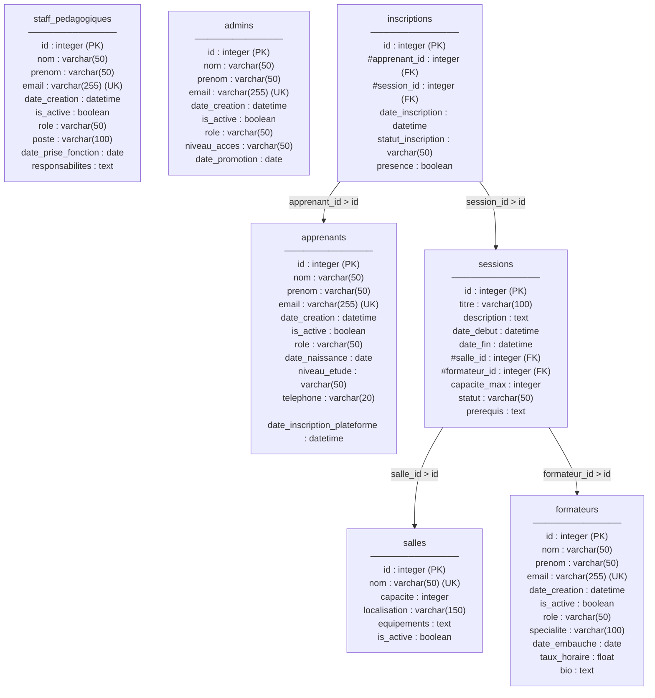

```mermaid
flowchart TB

    APPRENANTS["apprenants
    ──────────────
    id : integer (PK)
    nom : varchar(50)
    prenom : varchar(50)
    email : varchar(255) (UK)
    date_creation : datetime
    is_active : boolean
    role : varchar(50)
    date_naissance : date
    niveau_etude : varchar(50)
    telephone : varchar(20)
    date_inscription_plateforme : datetime"]

    FORMATEURS["formateurs
    ──────────────
    id : integer (PK)
    nom : varchar(50)
    prenom : varchar(50)
    email : varchar(255) (UK)
    date_creation : datetime
    is_active : boolean
    role : varchar(50)
    specialite : varchar(100)
    date_embauche : date
    taux_horaire : float
    bio : text"]

    STAFF["staff_pedagogiques
    ──────────────
    id : integer (PK)
    nom : varchar(50)
    prenom : varchar(50)
    email : varchar(255) (UK)
    date_creation : datetime
    is_active : boolean
    role : varchar(50)
    poste : varchar(100)
    date_prise_fonction : date
    responsabilites : text"]

    ADMINS["admins
    ──────────────
    id : integer (PK)
    nom : varchar(50)
    prenom : varchar(50)
    email : varchar(255) (UK)
    date_creation : datetime
    is_active : boolean
    role : varchar(50)
    niveau_acces : varchar(50)
    date_promotion : date"]

    SALLES["salles
    ──────────────
    id : integer (PK)
    nom : varchar(50) (UK)
    capacite : integer
    localisation : varchar(150)
    equipements : text
    is_active : boolean"]

    SESSIONS["sessions
    ──────────────
    id : integer (PK)
    titre : varchar(100)
    description : text
    date_debut : datetime
    date_fin : datetime
    #salle_id : integer (FK)
    #formateur_id : integer (FK)
    capacite_max : integer
    statut : varchar(50)
    prerequis : text"]

    INSCRIPTIONS["inscriptions
    ──────────────
    id : integer (PK)
    #apprenant_id : integer (FK)
    #session_id : integer (FK)
    date_inscription : datetime
    statut_inscription : varchar(50)
    presence : boolean"]

    SESSIONS -->|"salle_id > id"| SALLES
    SESSIONS -->|"formateur_id > id"| FORMATEURS
    INSCRIPTIONS -->|"apprenant_id > id"| APPRENANTS
    INSCRIPTIONS -->|"session_id > id"| SESSIONS
```